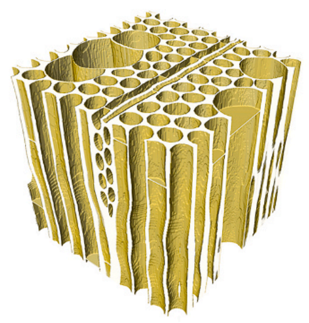
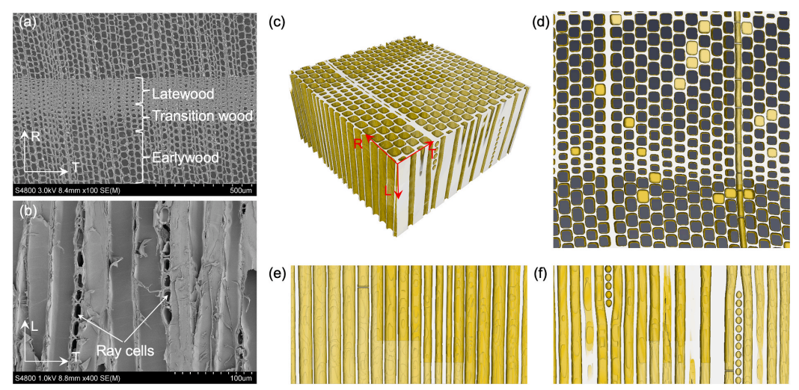

# Wood-Microstructure-Modeling
## Summary
This project generates realistic wood (Birch, Spruce, etc.) microstructures from a set of given parameters 
This project includes two parts：
1. **Birch microstructure generation;**
2. **Spruce microstructure generation;**

## Key features in the generated microstructure
- Ray cells are included in the wood structure. For birch, each group includes two columns of ray cells. Regarding to spruce, each group includes a single column of ray cells.  
- The ray cells will distort the fibers nearby, to mimic the real wood growth. 
- The impact of the ray cells in constraint into a small region.  
- Randomness is applied on fibers, vessels, and ray cells.
- Vessels can be involved in the microstructure. There could be isolated vessels, double-vessel clusters or triple-vessel cluster. 
- The fibers and vessels are distorted by the distortion map, which influences only the fibers nearby.
- Of course, the structure without vessel or ray cell can be easily generated.
- In spruce, the difference between early wood and late wood is simulated. The late fibers are compressed more, with thicker cell walls.

## Note  
The generation is time-consuming for large wood structure generation. Parallel computation using a multi-core CPU is used to speed up the computation. We tried to reduce the requirement of the memory size. In our application, $3000\^3$ voxels volume image can be generated with 32GB RAM. A larger structure needs more memory. The computation also requires saving and loading large amounts of data. Therefore, SSD is recommended.

## Usage
Download the project and save it into a selected folder.  
Read the notation of the parameters in the Matlab scripts.  
If you want to quickly run the projects. **Here are some notes**:   
- `cellWallThick` is should not be too small. We recommend using value larger than 3   
- `sizeVolume` should not be too small in order to include the ray cell features in the volume. I recommend to start with 1500 $\times$ 1500 $\times$ 750 as a start.   
- `cellR` is an important variable. It is roughly the radius of the fiber.  
`extraSZ` works well in most of the cases with the default values. If the obtained final structure in the final subfolder  `FinalVolumeSlice` includes some white boundary, you can increase this value a bit. 
- `isExistRayCell` is used to control whether there is any ray cell in the structure.
- `isExistVessel` is used to control whether there is any vessel in the structure.

The generated structure is saved in subfolder `FinalVolumeSlice`. The 3D volume is save as a set of 2D slices.

## Results
Here it is a generated microstructure of birch  
  
Here it is a generated microstructure of Spruce  
 

## Citation
[Chen, Bin, et al. "A distortion-map-based method for morphology generation in multi-phase materials-application to wood." Composites Science and Technology 244 (2023): 110262.](https://www.sciencedirect.com/science/article/pii/S0266353823003561)
Contact: binchen@kth.se
